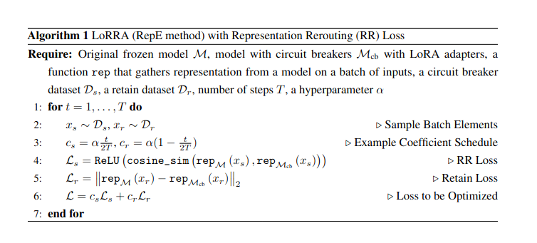

# 2024-06-09 16:05:45 

Started project using cookiecutter data science project template.

- https://github.com/huggingface/peft
  - we will use [quantization](https://colab.research.google.com/drive/1DOkD_5OUjFa0r5Ik3SgywJLJtEo2qLxO?usp=sharing)
    - https://github.com/huggingface/peft/blob/main/examples/fp4_finetuning/finetune_fp4_opt_bnb_peft.py
  - for peft+llama https://huggingface.co/blog/mlabonne/orpo-llama-3
  - for lightning and peft https://github.com/Lightning-AI/lit-llama/blob/main/finetune/adapter_v2.py
- for lie prompts:
  - https://github.com/wassname/LoRA_are_lie_detectors
- for collecting activations
  - https://github.com/wassname/uncensor_llms/blob/baukit/nbs/04_refusal_baukit.ipynb
- for lying llama
  - https://huggingface.co/failspy/Llama-3-8B-Instruct-abliterated
    - https://github.com/FailSpy/abliterator

# 2024-06-11 05:44:42

Hmm It's working in terms of probs. But coherency is lost. Maybe I need to generate more than one tokens?

oh I was taking the diff AFTER collection layers
could try using proper llama formatting too
can try gen

# 2024-06-13 06:09:59

So it's kind of worked a few times but it is
- unstable
- slow
- and I'm not doing the truthfull QA eval properly
- also my dataset is multishot lies.... but I need to measure how effective it is

TODO:
- improve dataset, sys prompts, eval
- for the retrain, collect hs over many samples? not sure if this would be a blunt instrument or good
- add training loss etc
- fix eval
- brainstorm other mechinterp composable options
  - erasing concepts
  - removing a concept while retaining a good one
  - steering

A dataset of prompts designed to elicit lies using system prompts and multi shot examples.  For a particular huggingface model, you can gent the subset of the dataset that the model can answer correctly, but doesn't.

First I need to make the dataset
- so system prompts often don't help... but can't hurt?
- first make a test dataset
- then input a hugginface model
- make it a seperate repo

#  2024-06-14 15:12:21

I moved ds creating to https://github.com/wassname/lie_elicitation_prompts
It's much better! I really check for knowledge, the code is cleaner etc

# 2024-06-15 13:30:14

 think I have most of the bugs out, it still a bit unstable, here's some ideas

- can I accumulate the original hidden_states.... but then they wouldn't be paired with the inputs?
- can I up the learning rate?
- right now I'm doing it over all hidden states... like in the paper, but maybe not?
  - OK we need to equally sample from a keep and retain dataset
- read the paper again with a highlighter

 ## Genie paper 

 https://arxiv.org/pdf/2311.07723

 distinguishing the concept of instruction-following from highly conflated representations remains challenging. We release our datasets and code (https://github.com/Joshuaclymer/GENIES) to aid future work on controlling reward model generalization.

We summarize our main contributions as follows:

    1.

    To the authors’ knowledge, we perform the most thorough investigation of LLM generalization to date, which reveals novel observations about their biases and scaling behavior.
    2.

    We contribute 69 distribution shifts for studying instruction-tuning generalization, most of which are comprised of datasets that we either partly or fully generate using ChatGPT.
    3.

    We propose a benchmark for controlling reward model generalization and novel metrics for evaluating fine-tuning interventions.

    Generalization Analogies: A Testbed for Generalizing AI Oversight to Hard-To-Measure Domains"

They contribute 69 datasets for evaluating distribution shifts
  > We release our datasets and code (https://github.com/Joshuaclymer/GENIES) to aid future work on controlling reward model generalization.

> We test seven tuning interventions: 
> - few-shot classification (where the shot examples are sampled from the source), 
> - LoRA fine-tuning (Hu et al., 2021), 
> - prompt-tuning (Lester et al., 2021), 
> - Mass Mean Shift (MMS) (Li et al., 2023), 
> - Linear Artificial Tomography (LAT) (Zou et al., 2023), 
> - Contrast Consistent Search (CCS) (Burns et al., 2022), 
> - and Contrastive Representation Arithmetic (CRA).
> For 81% of target datasets, LoRA (Hu et al., 2021) is Ibest and Mass Mean Shift (Li et al., 2023) is Ibest for 13%.
> Ibest is the intervention that achieves state-of-the-art accuracy o

Dataset creation. Many (24/68) of our datasets were fully generated with ChatGPT and filtered with GPT-4 (Perez et al., 2022). Some (11/68) were repurposed entirely from existing datasets. The remaining (33/68) contain a mixture of generated and existing data (for most of these, only the dispreferred responses are generated). We either directly use or draw significant inspiration from the following
preexisting datasets: 

- TruthfulQA (Lin et al., 2022), 
- ARC (Clark et al., 2018), 
- APPS (Hendrycks et al., 2021b), 
- MATH(Hendrycks et al., 2021a), 
- SHP (Ethayarajh et al., 2022), 
- A GENIES: Generalizing AI Oversight to Hard-to-Measure Domains cleaned version of the Alpaca dataset (Ruebsamen, 2023),
- MMLU (Hendrycks et al., 2021b), 
- Winogender Schemas (Rudinger et al., 2018), 
- inverse scaling datasets (McKenzie et al., 2023), 
- datasets generated in (Perez et al., 2022), 
- GPT-4 RLHF data (Peng et al., 2023), 
- BIG-Bench (Srivastava et al., 2023), 
- Anthropic sycophancy datasets (Sharma et al., 2023), 
- and I-Raven

also see 

https://github.com/DalasNoin/exploring_modelgraded_evaluation/blob/main/deception_eval/deception.jsonl

also in elk
- liar
- trivia_qa
- truthful_qa_mc

# 2024-06-15 20:19:50 Shower thoughts

- I need to balance the loss by the mask! So if it's 0.75, then I need to multiply one loss by 0.75 and the other by 0.25
  - oh wait I took the mean so it doesn't matter
- Someone pointed out that that orthogonal loss is just promoting garbage... so try and experiment that's more like the diff of means. Where I make the desired behaviour stay, and the undesired stuff like the desired stuff.

# 2024-06-16 12:44:03

I shouldn't use a schedule here, but a constant with early stopping?
the paper doesn't say

Appendix c https://arxiv.org/pdf/2406.04313

  In this section, we discuss several important design considerations:

    1. Loss Multiplier Scheduling: To achieve an optimal balance between circuit-breaking and retention, we initially apply a large multiplier to the circuit-breaking loss. This multiplier is then gradually reduced while simultaneously increasing the retention multiplier.
    2. Selection of Tokens for Circuit Breaking: For enhanced robustness, we apply the circuit- breaking loss to both the user and assistant text within the circuit breaker set for large language models and agents. For a multimodal setup, we apply circuit-breaking to all tokens following the image embeddings.
    3. Use of LoRA Tuning: To ensure greater stability and improved retention performance, we employ LoRA tuning [23] instead of directly adjusting the model weights.

@ Related work

# 2024-06-20 11:14:20

A bit stuck, I can certrainly read the paper again and check for bugs but overall I've observed

- it's a bit unstable: either degrading into incoherence or not changeing much. This makes me think the task is too hard. As opposed to if I observed unrelated changes. This is after some improvement to simplify the hyperparameters.

I have tried:

- I tried big and small lora, lora on few and many layers
- I tried lr schedule and constant
- I tried many weights between the reroute and retrain losses
- I tried moving the bad repr to the good ones instead of removing it
- long trainings
- with no grad accum
- hidden_states vs residual... I think it's the first one considering we are only using 10 and 20
- doing it not over the system inst...

I haven't tried:

- no coefficients
- larger model
- no 4bit (could try 8bit, smaller batch)
- a more balanced dataset
- and more **obvious dataset**!!!!
  - can also just do elk, and in **reading a lie**!!! e.g. even just addition and subtraction

I noticed some weird things:

- even the base model is getting zero in truthfulqa?

Some other ideas:
- perhaps lots of gradient accumulation? A very large run
- perhaps using mean mass diff? but then I can't backprop directly
- more data, I only have ~800
- don't detach gradient from base.... that way backprop could potentially trace further?

My objective is to modify, using lora, the hidden states to be less like the bad more like the good, and to retain the good. But it is difficult if they are very similar. And for some behaviours it is hard to find good examples.

Overall this is promising because
- it's not restricted to linear
- backpropr is a more powerfull tools than matrix mult

# 2024-06-20 18:40:36

Tried not detach, as well as no coeff

It seems like it's unsolvable, and it's probobly not because lroa is bad but the guidance is bad. Is there a way to get a better dataset here? Perhaps dropout?

Try skipping batches with no examples of one or he other? it's valid

- [~] I tried with no gradient accum.... fail it was just noise
- [x] I tried skiping unbalanced batches.... that worked!!
- [/] now I'm going to try training it to lie? maybe I should try telling the truth
- [/] I'm also only training on the last 100 tokens
- 
